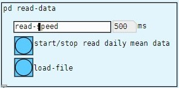
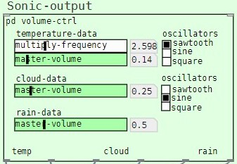
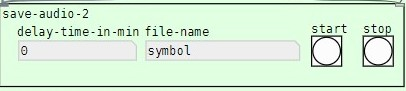

# About

This sonification system is a program built based on the distributions of <a href = "http://msp.ucsd.edu/software.html"> pure data environment </a> by Miller Puckette, this program translates numerical weather data from csv file into sonic outputs.

# How to use

1. Click on the start button in the 'Data-input' section  to run the sonification process, users may change the data reading speed through the 'read-speed' slider

2. Interact with the 'Sonic-output' section, by adjusting the oscillators, frequency and volumes for desirable sonic results

3. Lastly, if users wish to output the sonification result, use the 'save-audio-2' section to specify the duration (in minutes) and file name, after that click on the start or stop button to start or end the recording process.

